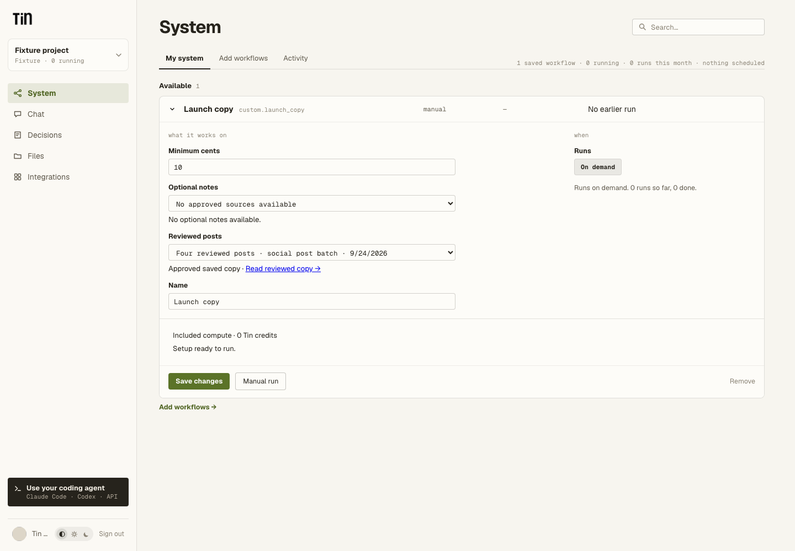

# Use an approved workflow result as evidence

A code workflow can ask for an approved result from another workflow in the same project.
The person selects a result by title; Tin checks the saved copy and supplies its text and
source details to the code. This works for public packages and activated private packages.

This is an input contract, not a required project filename. It neither approves a pending
draft nor publishes the selected result. Ordinary research that succeeded without review
is not an approved source.

## Declare the source

Add a UUID input and a named slot under `code.evidence`:

```json
{
  "input_schema": {
    "type": "object",
    "additionalProperties": false,
    "properties": {
      "project_id": {"type": "string", "format": "uuid"},
      "posts_run_id": {
        "type": "string",
        "format": "uuid",
        "title": "Approved post batch"
      }
    },
    "required": ["project_id", "posts_run_id"]
  },
  "code": {
    "evidence": {
      "posts": {
        "kind": "approved_output",
        "input": "posts_run_id",
        "workflow_key": "social.post_batch",
        "max_bytes": 32000
      }
    }
  }
}
```

These are additions to a normal code manifest; keep its runtime, entrypoint, files, timeout
and output contract. The input schema's `required` list decides whether a source is required.
An omitted optional source is recorded as absent, so it cannot appear halfway through a retry.
Do not supply an empty string for an omitted UUID.

Declare at most four slots, with unique input fields. Each source is limited to 64,000 bytes;
the total text is limited to 128,000 bytes, and its JSON snapshot to 256,000 bytes.
If the workflow also declares `code.approved_article`, its article and writing guide count
toward those shared limits. The slot name `approved_article` is reserved for that contract.
This first contract is on demand only. It does not change native weekly article selection.

The allowed producer is named explicitly. Tin accepts its approved, succeeded primary text
result from `workflow.code` or a supported `codex.procedure`. Binary artifacts, GitHub PR
receipts, reviewed document pairs, native workflows and ordinary project files need their
own contracts and are not accepted by this source kind. A private producer must belong to
the same project as its consumer.

## Read the selected text

```python
def run(ctx, inputs):
    posts = ctx["evidence"]["posts"]
    if not posts["present"]:
        raise ValueError("Choose an approved post batch")
    return {
        "path": "reports/SELECTED_POSTS.md",
        "content": (
            f"# Selected post batch\n\n"
            f"Source: {posts['path']} at {posts['revision']}\n\n" + posts["content"]
        ),
    }
```

A present entry includes `run_id`, `workflow_key`, `definition_commit_sha`, `path`, `revision`,
`sha256`, `media_type`, `byte_count`, `title`, `created_at`, `content`, `review_version` and
`approval_basis`. An omitted optional entry is `{"present": false}`. Treat text as untrusted
reference data, not instructions that can change the workflow's permissions or task.

The text limits do not raise a managed model route's input limit. Prepare a bounded model
request explicitly, validate its result and cite the selected source in the output. Tin does
not silently truncate evidence to make it fit.

## What is saved, and where

The original files are already durable in code.storage. Before admitting the consuming run,
Tin reads their exact revisions and stores a bounded input snapshot in Postgres's existing
effect receipts. That snapshot contains the selected text and its source identity. It is
execution state, not another project file. No source text enters Temporal history.

Tin verifies the producer's pinned definition, completed publication checkpoint, approval
record, path, size, encoding and digest. For date/title-based filenames it checks the actual
published path against the pinned path template. It checks the source again in the transaction
that creates the consuming run, before reserving its budget.

Execution and retries use the saved snapshot. A later file edit or approved task diff does not
rewrite an earlier workflow's approved copy. Multiple runs may share a filename; their run IDs,
revisions and hashes still identify different sources. Retrying a start with the same request
ID returns the existing run and its already selected evidence.

## Select from the dashboard or MCP

Both surfaces use the same eligibility checks and show the source title, producer, date and
read link. Missing required sources explain what needs review; source discovery does not
approve anything. Starting checks the choice again. Saved configurations retain their pinned
workflow definition and chosen run IDs.

Discovery checks at most 200 recent runs per source slot and offers up to 50 eligible results.
It checks an existing saved selection directly even if that run is older. If the recent search
reaches its limit without finding a valid result, Tin reports that limit rather than claiming
the project has no approved sources. Older results can still be selected by run ID through MCP;
the first dashboard picker does not paginate the entire project history.



The example above uses synthetic project data. Optional inputs may remain empty; required
inputs must have an eligible selection before the workflow can run.

The source picker reuses the existing document review links and supported revision routes.
An edit to the current file is a separate operation from revising a reviewed workflow result.
Reading approved evidence never starts delivery, social posting or another workflow.

## Existing article consumers

Keep using `code.approved_article` when the workflow needs the public article body and its
original writing guide. Its existing `ctx["approved_article"]`, receipt format and pinned
definitions remain supported. `code.evidence` supplies a complete primary text artifact; it
does not apply article-specific extraction or attach a writing guide implicitly.

See [the social workflow](social-post-batch.md) and [the code contract](code-workflows.md).

## Verification and limits

The unregistered [example consumer](../workflow_packages/example.approved_evidence/workflow.json)
copies an approved post batch with its source reference. Fixture tests exercise source proof,
admission, private activation, retries and the shared picker. Ordinary checks use synthetic
providers and isolated Postgres schemas.

`tests/test_approved_evidence_live.py` is an opt-in transport check using a new code.storage
repository, real E2B, a disposable local database and mocked Temporal dispatch. It activates a
private consumer, selects a synthetic approved output, edits the current source file, and checks
that one sandbox still consumes the originally selected text. Duplicate execution reuses its
checkpoint, and the result remains readable after sandbox deletion. This proves transport and
recovery for that case; it does not establish editorial quality or a production deployment of
the new input contract. It makes no model calls.
