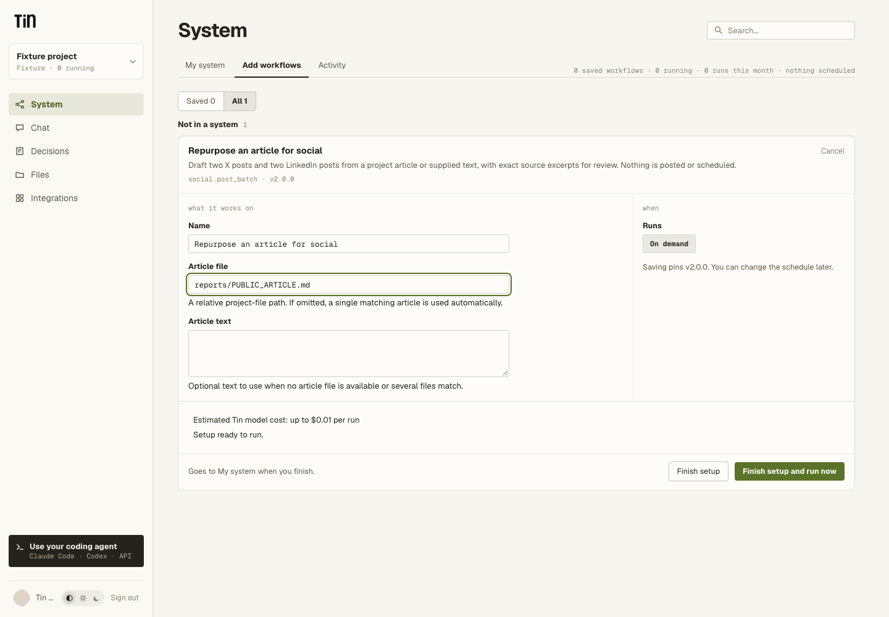

# Read project files in a code workflow

The project repository holds the files workflows share: brand guidance, writing style,
research, plans and earlier results. A public or private `workflow.code` package reads them
through `ctx.files`. It does not need an evidence declaration, a producer workflow, an
approved source run, or a user-selected revision.

```python
def run(ctx, inputs):
    try:
        brand = ctx.files.read_text("BRAND.md")
    except FileNotFoundError:
        brand = inputs.get("brand_notes", "")
    if not brand.strip():
        raise ValueError("Add BRAND.md or supply brand notes")
    return {"path": "reports/BRAND_REFERENCE.md", "content": brand}
```

`brand_notes` is an ordinary optional string in this example's input schema. Both MCP and
the dashboard can supply it. A file takes precedence here; another workflow can choose its
own clear rule. Only a missing file triggers fallback: an unsafe path, invalid text or an
oversized file must not silently become a different source.

See the complete [example package](../workflow_packages/example.project_files/workflow.json).
Like other examples, it is unregistered; a private copy uses ordinary validation and activation.



The screenshot uses synthetic project data.

## File interface

These methods are synchronous, like ordinary Python file reads:

| Method | Result |
| --- | --- |
| `ctx.files.read_text("BRAND.md")` | The complete UTF-8 text, or `FileNotFoundError` if absent. |
| `ctx.files.read_bytes("data/sample.bin")` | The complete bytes, with the same path and size checks. |
| `ctx.files.glob("reports/*.md")` | Matching project-relative paths in stable order. |
| `ctx.files.read_section("### Code map")` | One section of project memory (`wiki/INDEX.md`), or `FileNotFoundError` if it has none. |

Paths are relative to the owning project's code.storage repository. These methods do not
read the connected GitHub repository or another project's files. Package resources remain
available through ordinary Python reads in the package directory; `code.files` still lists
the executable package's own resources, not its project data dependencies.

Each read is limited to 1,000,000 bytes. Globbing returns at most 100 matches and refuses a
larger result rather than silently dropping paths. A code execution permits at most 256 file
requests, separately from its model and service limits. Paths must be safe regular files;
symlinks, parent traversal and protected credential paths are rejected. Binary reads are
supported within the same bound; they do not increase the workflow's text-output or model
request limits. No storage credentials enter the sandbox.

Read and validate inputs before making a paid model request. A known required path may use
the existing artifact prerequisite to explain missing setup before launch. File reads are
lazy, so a missing path found during execution can still consume sandbox time. There is no
extra manifest or approval step for an ordinary file.

## Project memory sections

Workflows that map the product keep their results in project memory, not in files of their
own: `product.code_map` writes the `### Code map` section and `product.deep_dive` the
`### Feature map` section of `wiki/INDEX.md`, under `## Product`. Read one with
`ctx.files.read_section(heading)`. It returns the section from its heading line (which may
carry the writer's parenthetical, such as `### Code map (verified 2026-09-04, ...)`) up to the
next heading, exactly as the writer bounds it. It reads the index at its own size bound and
returns only the section, which must fit the 1,000,000-byte read limit.

Some packages were written to read the Code map from `product/code-map.md`. When the project
has no such file, that read returns the `### Code map` section, so they find what
`product.code_map` wrote. A real file at that path still wins. New packages should call
`read_section`.

## Latest files for new runs, stable files for retries

At admission, Tin reads the project's canonical HEAD and records that revision in an
existing effect receipt, in the transaction that creates the run. The code cannot choose a
different revision. Every file read in that run uses the recorded revision; subsequent
edits do not change an execution in progress or its retry.

A new run, including a scheduled occurrence, records the current HEAD again.
Reusing a start request ID returns the original run and its original files. This data
revision is separate from the workflow's executable package revision and from the
concurrency guard used to publish its output.

The receipt stores only project, repository and revision metadata. File contents remain in
code.storage and travel through Tin's protected read channel when requested; they are not
copied into a new evidence database or Temporal history.

## Existing workflows and approval

Pinned definitions using `code.evidence` or `code.approved_article` still load their original
inputs and receipts. This compatibility code keeps saved configurations and historical runs
usable. The generic source picker and its discovery API have been removed, and the authoring
guide now teaches file reads. Update an old private package to `ctx.files` when revising it;
editing a package alone does not replace an already saved definition.

Reading a file does not prove that someone approved its current contents. A workflow that
publishes, sends or applies reviewed changes must keep that action's approval contract.
For example, `content.deliver` still selects an exact approved article before creating a
GitHub PR. Those delivery checks do not restrict ordinary project-file reading.

## Verification

Focused tests cover admission, repeat starts, edits between runs, missing-file fallback,
Unicode and binary reads, bounds, unsafe paths and legacy execution. Browser tests cover
ordinary schema inputs without source selection. The opt-in
`tests/test_code_project_files_live.py` uses real E2B and code.storage with synthetic files
and disposable local product state; it makes no model calls. Live checks require explicit
provider authorization and are separate from normal contributor CI.
