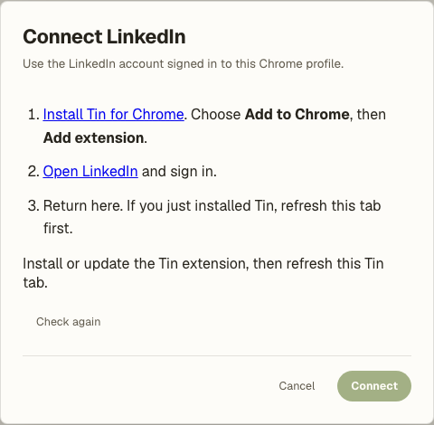
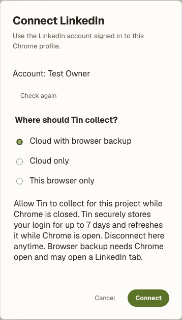
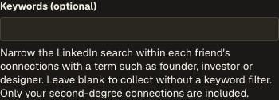

# Connection collection

`connections.collect` is an operator-enabled native workflow. It takes one to three
LinkedIn profile URLs, an optional keyword query and an execution policy. Each selected
profile must be a visible first-degree connection. Results are second-degree connections;
mutual first-degree connections are excluded. This integration supplies reusable collection
and export machinery. Project-specific research and delivery belong in private packages.

## Enable a project

Apply migrations through the normal deployment process. Set
`TIN_LITE_CONNECTION_COLLECTION_PROJECTS` to the designated project UUIDs and
`TIN_LITE_LINKEDIN_EXTENSION_IDS` to the allowed Chrome extension IDs, both comma-separated.
These lists default to empty. An integration appears only on an enabled project.
Membership and the allowlist are checked again on every device operation and publication.
The account owner who paired the extension must start the collection.

## Connect once, then run from Tin

On an enabled project, choose **Integrations → LinkedIn → Connect**. The setup screen gives
three steps: install Tin for Chrome, sign in to LinkedIn in the same Chrome profile, and
return to Tin. It detects the extension version and account before enabling confirmation.
Users choose **Cloud with browser backup**, **Cloud only**, or **This browser only** once.
New workflow setup uses that choice as its default; existing saved workflows keep their mode.





The published extension must be updated to 0.4.0 for this screen. See the extension's
[installation guide](../browser-extension/README.md) and [store release](../browser-extension/STORE_RELEASE.md).
The setup page gives its five-minute, one-use pairing token an expected account and the
user's selected mode. The extension creates a device bearer locally and sends its hash.
The service records continuing permission only from this authenticated confirmation.
Earlier single-run transfers do not imply continuing permission.

Device bearers expire after 30 days and require current project membership. Reconnecting
invalidates the older device. Migration confirms retirement of this browser's legacy Tin
device through its existing endpoint before allowing collection. It does not sign out of
LinkedIn or change browser cookies. Settings can change collection permission for the same
account; selecting another account requires explicit pairing again.

Start the workflow through the dashboard or MCP run API. Enter full LinkedIn profile URLs,
separated by commas in the dashboard; names alone are not supported. Click **Manual run**.
The extension automatically claims queued work and refreshes cloud access as needed. The
popup can close; routine runs do not require a second click or a repeated permission prompt.
Local collection opens an inactive collection tab and needs Chrome open and awake.

Cloud choices remain visible when compute is unavailable. A cloud-preferred run can use
Chrome if the connection permits browser backup. A cloud-only connection pauses instead of
silently widening that permission. Pauses name the action needed in run progress.

Keywords narrow LinkedIn's search within each selected friend's connections. For example,
enter `founder` to target that term, or leave the field blank for no keyword filter.
The second-degree filter applies either way.



## Resume and limits

Each run pins its inputs and policy. Version 2 allows up to 24 hours waiting for Chrome
before the first collection attempt. The active budget starts once: three friends, 20 pages
and 200 people per friend, 15 minutes per friend and 45 minutes overall. Closing Chrome or
resuming does not reset these limits. Earlier version-1 definitions keep their original
45-minute deadline including waiting. An account lease prevents two active runs by the same Tin account owner from
collecting that observed account across projects. This is an observed account binding,
not proof of ownership of another person's LinkedIn account.

The worker persists each batch before uploading it. Postgres acknowledges the exact batch
before navigation. Duplicate acknowledgements, including the final page, are idempotent.
A new device attempt gets a new generation and lease; stale uploads are rejected. Visible
page identity, account, friend filter and all search filters must remain consistent. Repeated
pages, ambiguous pagination, unreadable results and hidden controls do not imply completion.
The adapter currently supports English desktop pages and semantic profile/search evidence.

Results are create-only files under `connections/<run-id>/`: a manifest, CSV and bounded
JSON chunks for people and friend paths. People are deduplicated while each observed friend
path remains available. CSV values are protected against spreadsheet formulas. Coverage is
explicitly limited to visible results; limits and interruption produce partial results.
Accepted pages survive disconnect and publication failure. Canonical publication uses the
project lock, expected HEAD and the shared lost-response reconciliation helper.

## Cloud candidate and local backup

The source includes a dedicated read-only HTTP adapter. It reproduces the published
extension's cookie allowlist, user agent, language and LinkedIn request context. It does not
launch a browser, run website JavaScript, follow authentication redirects, write cookies back,
or call a logout endpoint. The extension uploads this material after the user enables cloud collection during setup.
Tin encrypts it with the existing integration cipher and binds it to the project, account,
permission and paired device. Retention is at most seven days, capped by the login-cookie
and device expiry; a session cookie without a declared expiry is kept for at most one day.
The extension refreshes access within a day of expiry while Chrome is open. Raw credentials
never enter chat, MCP, Temporal history or project files.

A run pins the credential generation it uses. Disposable compute cleanup does not delete
continuing permission or a reusable session. Expired sessions, revoked devices and lost
membership are purged independently of workflow runs. Switching to browser-only clears the
session immediately and fences active cloud uploads; disconnecting uses the existing
integration revocation path. Old single-run transfers remain run-bound and are deleted on
finalization. An account change or LinkedIn challenge requires attention, not an automatic
cloud/local retry.

During setup the extension observes a supported search query and matching client context.
With a valid session, cloud execution resolves each newly selected friend using a fixed
read-only request, requiring exact profile identity and linked first-degree evidence.
Unsupported evidence waits for Chrome to prepare that friend, preserving the same checkpoint.
This provider response shape is fixture-tested; live qualification is still required. No
cloud browser login screen is part of setup.

Cloud execution uses the existing `E2B_API_KEY` with a dedicated
`TIN_LITE_LINKEDIN_TEMPLATE`, `TIN_LITE_LINKEDIN_CLOUD_ENABLED=true` and the integration
encryption key. The optional `TIN_LITE_LINKEDIN_E2B_API_KEY` overrides the existing key
for operators who want a different account; it is not required. The old
`TIN_LITE_LINKEDIN_CLOUD_QUALIFIED` setting is accepted as a compatibility alias.
Enabling the runtime permits an operator's designated-project pilot; it does not assert
that live acceptance has passed.

Build only the collection image from the repository root:

```sh
python sandbox/linkedin/template.py --alias tin-linkedin-http-v2
```

The script accepts the existing E2B key and refuses ordinary Tin image aliases. Its
build context includes only the explicitly copied collection modules and runner, and
an import check runs inside the image. Existing Codex, isolated code, browser and Studio
templates and routing are unchanged. A separate Temporal activity queue
(`<base>-connections`, capacity 2) bounds collection work without occupying their worker
slots. The same E2B account still shares its provider quota; a separate image does not
reserve capacity. Check account headroom before expanding the pilot.

Before wider rollout, verify full pagination, matching cloud and DOM page boundaries,
correct identity, preserved normal-browser login through cleanup and later source checks,
and recovery after worker/sandbox interruption. The current GraphQL parser is deliberately
narrow: unsupported schemas stop collection. An observed query identifier comes from the
selected browser view, never from an arbitrary user-supplied request URL.

Execution policies are pinned for the run:

- `local_only`: Chrome performs the collection automatically when available.
- `cloud_only`: use the saved session; wait for Chrome if session refresh or friend
  preparation is needed. Results are collected in cloud compute; cloud failures pause.
- `cloud_preferred`: use the saved session. When the runtime is unavailable or a recoverable
  cloud failure occurs, continue in Chrome if the saved permission allows browser backup.
  Accepted pages, filters and cumulative limits are preserved. Cleanup must be confirmed
  first. The extension resumes automatically when awake with the correct account.

Challenges, rate limits, account changes and access denials pause rather than trigger a
handoff. Uncertain cleanup also pauses. No cloud retry silently creates another paid attempt.
Each page attempt has an effect receipt, bounded compute lifetime, network access restricted
to LinkedIn, root-only transfer files and usage/cleanup observations. Collection is Tin-funded
under its explicit connected-account billing policy; recorded supplier usage remains separate
from the zero customer charge. Missing supplier observations remain unconfirmed.

Cloud pagination and source-login preservation have not passed production acceptance. There
is no deployment, image build, provider configuration change or store release implicit in
installing this source.

## Verification

Use a disposable database for SQL contracts, never a configured customer database:

```sh
TIN_LITE_TEST_DATABASE_DSN=postgresql://... uv run pytest tests/test_connection_collection.py tests/test_connection_collection_setup.py tests/test_connection_collection_lifecycle.py
npm ci
node --test web/linkedin-setup.browser.test.js
npm test --prefix browser-extension
npm run test:collection --prefix browser-extension
```

The Chrome tests use synthetic pages and a local fixture backend. The cloud tests use mocked
provider responses and check the separate image, request context, single purchase, cleanup,
usage receipt, fencing and backup policy. Live acceptance is a separate operator action.
