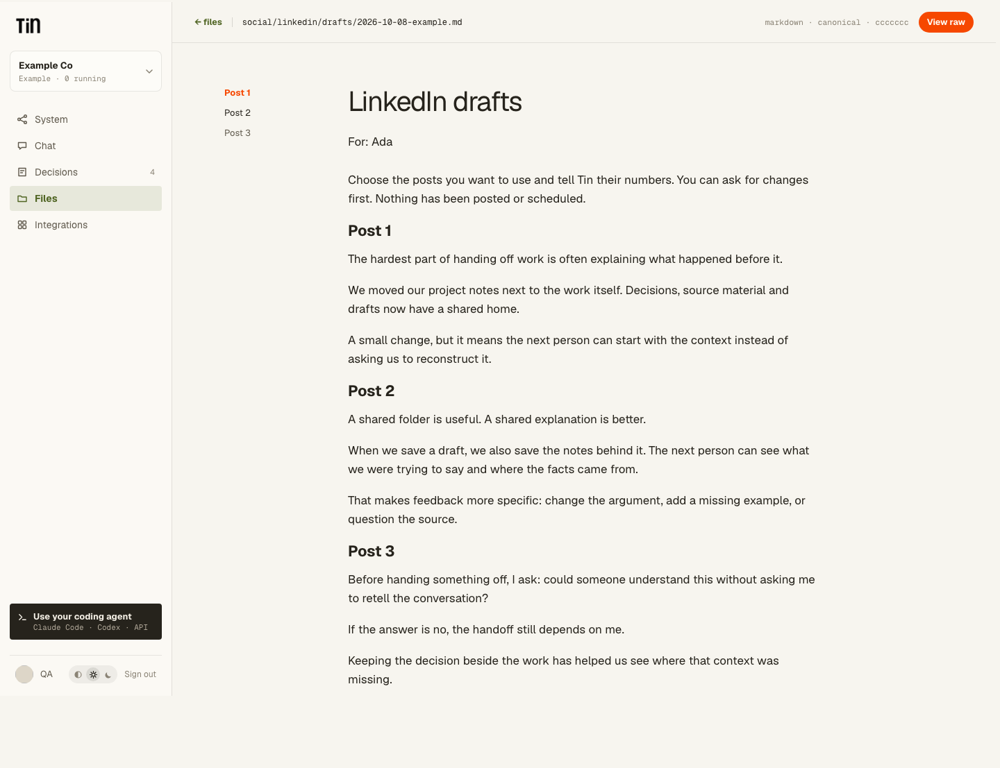

# LinkedIn drafts

LinkedIn is a separate workflow group. The existing Social group keeps its `x` identifier.
Eligible projects see Collect connections in LinkedIn. Private packages may declare
`system: linkedin`; this does not activate them or grant access to other projects.

Drafting produces an ordinary Markdown document in project Files, like an article or a
social post batch. A document at `social/linkedin/drafts/{date}-{slug}.md` opens through
the existing run-output and file reader, with numbered posts and section navigation.
The founder can read the alternatives together and tell Tin which post numbers to use
or change. Choosing a draft does not post, schedule or authorize publication.

Keep post copy separate from source packets, format examples and internal editorial notes.
Plain-text post punctuation must be escaped when writing Markdown so a draft cannot turn
into document controls, embedded HTML or unintended formatting. A draft that still needs
verification should be labeled accordingly. Missing material should produce a useful
explanation, not invented posts.

Reading, downloading and editing use ordinary project file services and their membership
and revision checks. There is no LinkedIn-specific reader, file API or posting control.
Private package validation and activation remain separate project-bound operations.
Generation requires no LinkedIn connection.

Package authors can put optional infrequently changed inputs behind **More options** using
`x-tin-ui: {"advanced": true}`. Required inputs remain visible. This hint changes only form
presentation; all fields retain the same validation and run pinning.

The synthetic browser fixture checks the shared reader, section navigation, light and dark
appearance and narrow layouts. It does not establish live generation quality or publishing
access.

