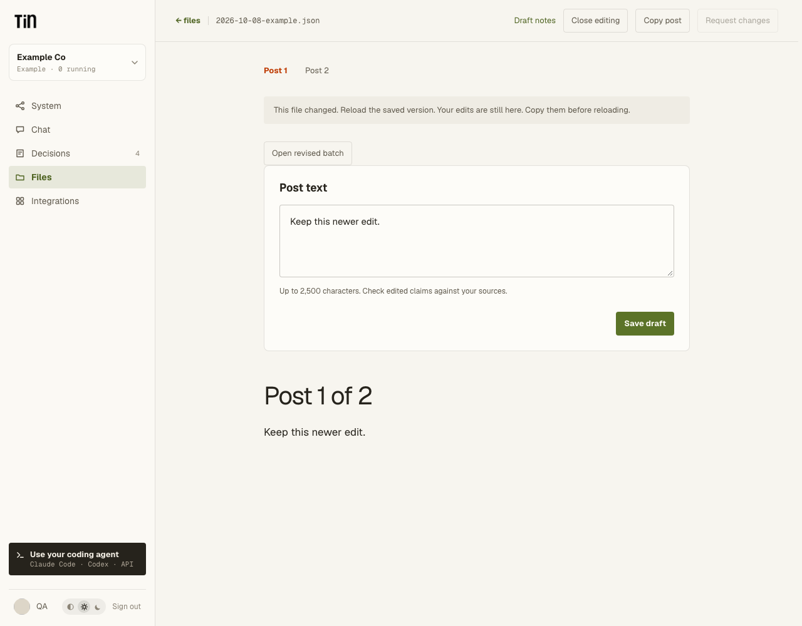

# LinkedIn draft files

LinkedIn is a separate workflow group. The existing Social group keeps its `x` identifier.
Eligible projects see Collect connections in LinkedIn. Private packages may declare
`system: linkedin`; this does not activate them or grant access to other projects.

A bounded JSON file at `social/linkedin/drafts/<name>.json` with schema version
`tin.social.linkedin_draft.v1` opens in a draft reader from its run. Files also offers
**Open LinkedIn drafts** on that JSON file. Read one alternative at a time, open **Draft
notes** for supporting excerpts, **Edit post**, **Save draft**, or **Copy post**.
Text is rendered literally, including Markdown punctuation. Copy includes only post text.

The schema holds a stable batch ID, author, audience, selected guidance paths, labeled
sources, up to six posts, evidence gaps, and an optional parent file/hash/post reference.
Source roles are `publishable`, `background` and `reference`. Supporting excerpts must
match publishable sources exactly. This structural check does not prove semantic support
or establish that the person consented to publication.

Each post has an ID, text, angle, format ID, readiness, supporting excerpts and editorial
notes. Text has a 2,500-character product limit; the whole file is bounded to 128 KB.
`ready` means a draft to review, never a publication approval. Editing marks a post `edited`.
A batch with no usable posts may explain the missing evidence in `gaps`.

The authenticated HTTP endpoints are `GET` and `PUT`
`/api/projects/{project_id}/linkedin/drafts`. MCP exposes `read_linkedin_drafts` and
`save_linkedin_draft`, backed by the same service. Saving requires the current project
revision and a stable request ID. Conflicts preserve unsaved browser edits. These are
ordinary project files; reading and editing requires project membership, not a LinkedIn
connection or a particular generating workflow. Neither file endpoint can publish or start a
paid model call. Private recipe activation remains a separate project-bound operation.

For a batch produced by a compatible, active private code workflow, **Request changes**
starts that workflow's pinned revision through normal admission and model billing. The
HTTP operation is `POST /api/projects/{project_id}/linkedin/drafts/revisions`; MCP exposes
`revise_linkedin_draft`. Both bind the selected post and feedback to the current file hash.
Reuse the same request ID after a lost response. A later edit does not prevent retrieving
an already accepted request; changed feedback under that ID is refused.

The producing run must belong to this project, have succeeded, and reference the selected
artifact. Its immutable package must declare the LinkedIn group, the dated draft JSON
output and revision inputs, without integration or service bindings. Ordinary uploaded
JSON cannot select an arbitrary workflow to execute. Revisions create a new batch;
**Open revised batch** leaves the original and any unsaved edits available.

Private package authors can put optional infrequently changed inputs behind **More
options** using `x-tin-ui: {"advanced": true}`. Required inputs remain visible. This hint
changes only form presentation; all fields retain the same validation and run pinning.

Tests use synthetic sources and browser/HTTP/MCP fixtures, including literal text,
plain-text copying, preserved edits, membership revocation, idempotent saves and revision
conflicts. They do not establish the quality of a model-generated post or publishing access.

Synthetic example: a conflicting save keeps the local edit and offers the completed revision
as a separate batch.

