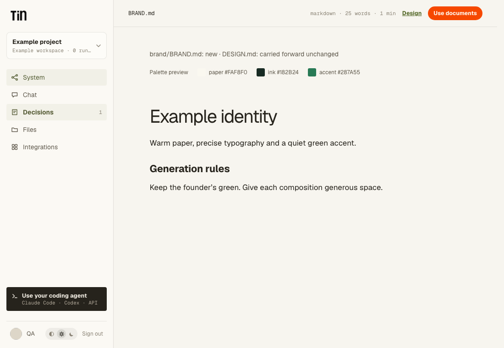

# Reviewed project documents

A public Codex procedure can propose two Markdown documents and apply them to fixed project
paths after one exact-version approval. This uses the existing review command queue,
publication receipts and atomic code.storage commit. It adds no executor or database table.

The procedure output contract declares both proposals and both destinations:

```json
{
  "kind": "project.artifact",
  "path_template": "brand/proposals/{run_id}/BRAND.md",
  "media_type": "text/markdown",
  "max_bytes": 48000,
  "companion": {
    "path_template": "brand/proposals/{run_id}/DESIGN.md",
    "max_bytes": 64000,
    "label": "Design"
  },
  "apply_on_approval": {
    "primary": "brand/BRAND.md",
    "companion": "DESIGN.md"
  }
}
```

Each proposal must have a distinct run-owned path, with one `{run_id}` substitution. Both
outputs are required, nonempty UTF-8 Markdown, at most 64,000 bytes each. Destinations are
ordinary fixed Markdown paths, separate from proposals and managed runtime files. This
contract requires `human_review.eligible: true`; it cannot combine with a section writer,
arbitrary output validators or external delivery. The registered `brand-design-capture.v1`
validator adds first-capture preservation and brand/design structure checks. Private packages
retain their existing narrower contract.

The sandbox writes only the two proposals. The switchboard validates and checkpoints both,
then publishes them together for review. Neither active destination changes at this stage.
Existing article generation companions keep their original contract and size limit.

The review response describes each destination as new, updated or carried forward unchanged.
The normal artifact reader links the companion. Approval through HTTP, Decisions or MCP must
supply the token from `GET /api/workflows/runs/{id}/review` / `get_workflow_review`. The token
binds the immutable proposal pair and the original contents (or absence) of both destinations.
Editing a proposal invalidates approval; start another run or use Files for a manual edit.

The existing approval activity applies the exact pair in one expected-head commit. An edit
to either destination blocks the whole application, including edits after approval. Unrelated
project edits may proceed. Retries reconcile a prior application before writing again; a
later founder edit is never replaced by replaying a successful approval. Membership and
active run authority are checked immediately before an effect. A completed application
receipt is required before the run can succeed.

The proposal revision stays the run artifact. Adoption records its own revision in an
existing effect receipt and a product Activity event. No process or sandbox must survive
review. A conflict leaves the proposals readable and the active destinations untouched.
There is no automatic merge or proposal rebinding.



## Optional repository evidence

Public artifact procedures can use a read-only repository when connected, while still
running for projects without a repository. Declare:

```json
{
  "workspace": {
    "kind": "github.repository",
    "provider_key": "infra.github",
    "capabilities": ["contents.read"],
    "optional": true,
    "enabled_input": "include_repository"
  }
}
```

Declare the matching optional `infra.github` integration requirement with `contents.read`,
and a boolean `include_repository` input. The input selector is optional; without it, a
connection is used whenever present. A connected account with no selected repository is an
error: select one or explicitly disable repository evidence.

Tin records the source selection before compute. Retries retain a site-only decision; a
selected repository changing or disappearing fails instead of silently downgrading evidence.
The existing integration gateway supplies a snapshot pinned to one commit, including its
completeness flag. It supplies no GitHub credential. Source and project-state checkouts stay
separate; only declared project artifacts can be delivered. Optional repositories cannot
produce PRs or request additional GitHub capabilities.

## Verification and rollout

`tests/test_reviewed_documents.py` exercises pair validation, approval, destination races,
lost acknowledgments, membership and optional-source selection using disposable Postgres
schemas and an in-memory immutable storage history. Existing review/publication and Temporal
replay tests cover unchanged procedures. Browser tests cover the shell controls.

This is source support, not hosted rollout acceptance. Rebuild the applicable sandbox image
before enabling a package with this contract. The runner must answer
`--check-reviewed-documents` with `TIN_PROCEDURE_DOCUMENTS_V1`; unsupported images fail before
a model invocation. No migration or new Temporal command sequence is required.
