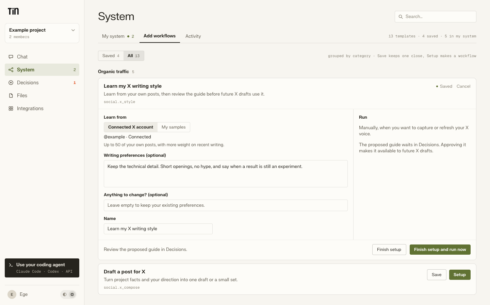
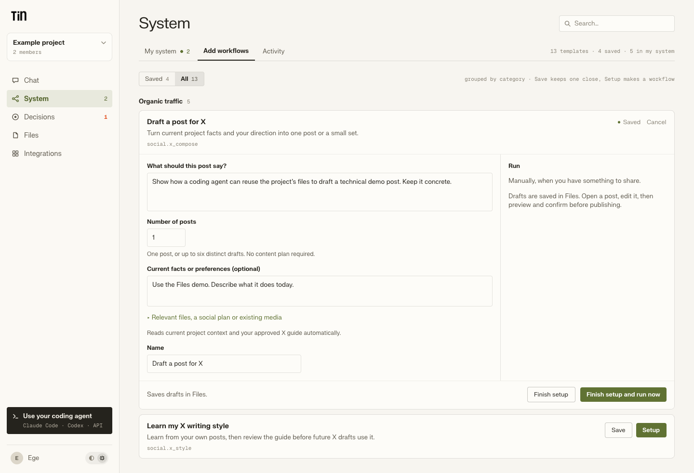
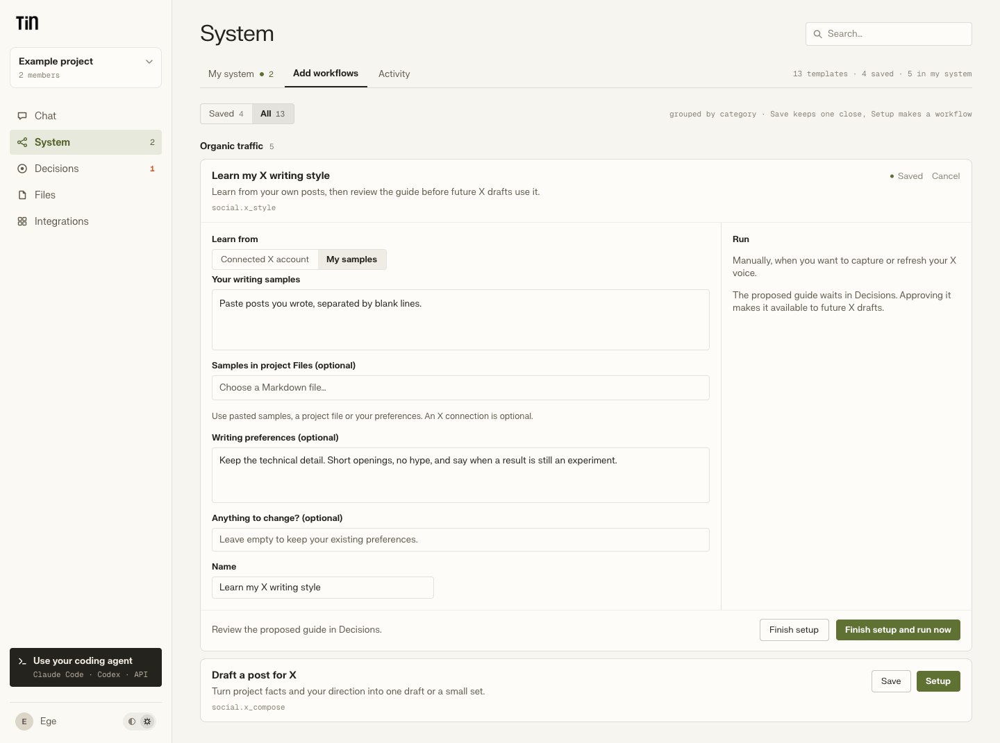
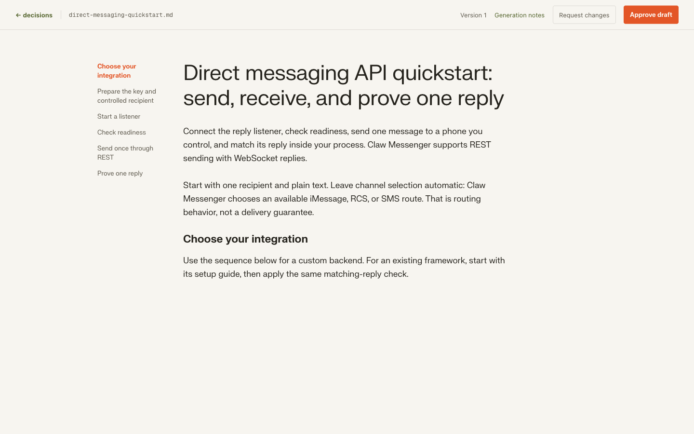
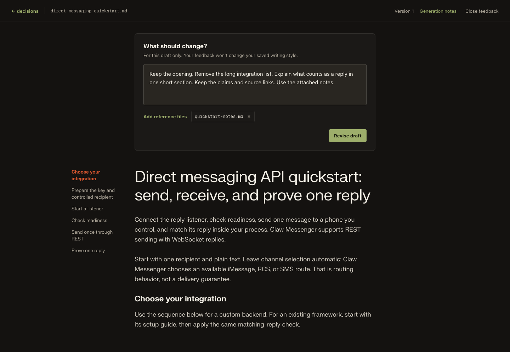

# Draft and publish on X

Tin can learn your X writing style, draft one post or a small set, and publish an
individually confirmed post with images or a video. Drafts and media live in the
project's ordinary Files. You can use the dashboard or ask your coding agent to work
through MCP; both use the same preview and publication service.

The implementation is tested with simulated X responses. Deployment, X app configuration
and testing with a connected account are still needed before it is ready for production use.

## Connect an account

The X card in Integrations connects one X account to the selected Tin project. Connecting
for voice sampling grants read access. Publishing asks for write and media permissions
through X's authorization screen. Reconnecting keeps existing granted capabilities.
Tin stores the tokens encrypted and refreshes them on the server; workflows and project
files never receive the credentials.

For a self-host, configure `TIN_LITE_X_OAUTH_CLIENT_ID` and
`TIN_LITE_X_OAUTH_CLIENT_SECRET`, together with the existing
`TIN_LITE_INTEGRATION_CREDENTIAL_KEY`. Register the callback
`https://<your Tin origin>/integrations/callback/x` in the X app. The hosted callback is
`https://app.tin.computer/integrations/callback/x`. The server exchanges the code through
`POST /api/integrations/x/complete` after checking the signed-in user, project membership,
state and PKCE verifier. Configure OAuth 2.0 with the read, write, media and offline
scopes required by the features you enable.

Deploy the web service and worker together, apply `052_x_connection.sql`, and sync the
catalog so the connection tables and workflow definitions recognize X. The migration
extends the existing integration provider constraints; it adds no tables.

The app operator pays X API credits separately from Tin's model costs. X publication
has no Tin model charge in this first release; this does not make the X API free.
Sampling is bounded to three timeline requests and 150 returned posts per capture.
Check current X pricing and app permissions before enabling the connection.

## Learn a voice, then draft

Run `social.x_style` when you want Tin to learn from your own public X account. It aims
for 50 usable posts, with more weight on recent writing and some examples from earlier
months. It excludes reposts, quotes, duplicate text and thin replies, and limits bursts
from one day. A sparse account produces a smaller sample with its limits stated in
the guide. You can instead supply writing samples, a Markdown file in Files, or explicit
preferences without connecting X. In the expanded setup panel, choose **Connected X account**
or **My samples**. Writing preferences can refine either source; they do not replace
connected-account sampling. The browser hides account IDs and offers a Markdown file
picker for saved samples. MCP can set `sample_source` explicitly, or omit it to infer
the source from supplied inputs.

The proposed guide waits for review. Approval saves
`.agents/skills/x-writing-style/SKILL.md`; you can edit it like any other file. A concurrent
edit is preserved and the proposed result remains available for comparison. Guides carry
an account identifier so another account's habits do not silently become your voice.
Raw API post bodies are used transiently for extraction, not committed to Files or retained
in execution receipts. The derived guide and sampling counts are durable.

Run `social.x_compose` with a direction such as “show what changed in this demo and why it
matters.” It reads current project context and the X guide, plus any selected evidence,
existing assets or optional social plan. A plan is not required. Choose one to six drafts;
each needs its own useful point. Technical claims, quotes, numbers and links must have
support in the supplied material. Missing facts or demo assets are called out for editing.

The result is `social/x-drafts/{date}-{slug}.json`. It contains post text, supporting
excerpts, editorial notes and media paths. Creating a draft sends nothing to X. Each new
run reads current project files; retries keep the run's internally pinned snapshot.

## Review and publish one post

Open the draft from its run or Files. It opens in the dashboard reader, showing one post
at a time. Select **Edit post** to change the text, choose an image or video from Files,
or upload media. **Draft notes** holds supporting evidence and anything still missing.
Unsaved edits stay available when you move between posts or leave and return in the same
browser session. Save them to Files before closing or refreshing the browser.

Choose **Preview post**, check the connected account, exact text and attachment order,
then select **Publish this exact post**. Missing evidence or assets must be resolved
first. A changed post, attachment or account requires a new preview. The reader follows
the dashboard’s light and dark themes; its URL also works when opened through MCP.

The first release accepts:

- Text within the standard 280 weighted-character limit; links and emoji receive X-aware
  validation. Borderline unsupported Unicode sequences may be rejected conservatively.
- Up to four JPEG or PNG images, each at most 5 MB, with optional image alt text.
- One H.264 MP4 video with optional AAC audio, at most 64 MB and five minutes.

These are Tin's initial limits. Passing local metadata checks does not guarantee that X
will accept a particular encoding. Images and videos are uploaded from the approved Files
revision; arbitrary media URLs are not fetched. Video upload and processing checkpoints
survive activity retries. Media generation, scheduled posting, threads, replies, quote posts
and post analytics are outside this release.

Publication runs as `social.x_publish`. Its ordinary workflow-start endpoint cannot bypass
confirmation. Durable receipts identify the approval, uploaded media and confirmed X post.
Duplicate confirmation returns the same run. If X may have accepted a request but the result
was lost, Tin stops automatic resend and asks you to check the account. A confirmed post can
recover its Tin report without posting again, even after disconnecting X. The result is a
run receipt under `reports/x/`, with the public post link.

## MCP

Use normal workflow discovery and `start_workflow` for style capture and composition.
Then use `read_x_drafts`, `save_x_draft`, `preview_x_post` and `publish_x_post` to edit
and deliver the selected post. Publishing consumes the preview token and a stable request
ID; retry the same request after a lost acknowledgement. Show the exact preview and obtain
the user's publication instruction before calling it. File paths refer to the bound project;
the upload handoff uses the browser instead of sending large base64 files through MCP.

## Verification

### Design references

The source is Page 1 of [thinklikeanagent in Paper](https://app.paper.design/file/01M0TWXA4TWEXQTK664B7997HZ/1-0).
Boards 135–137 are new X-specific designs built from Tin's existing expanded System
cards: connected-account voice capture, post drafting, and voice capture from supplied
samples. They show the actual inputs and manual-run behavior rather than another
workflow's example fields.

Drafts mount the existing generic document viewer. The voice guide is Markdown;
publishable drafts remain JSON to preserve post IDs, evidence and ordered attachments.
The reader displays escaped, literal post text so Markdown punctuation cannot change
what gets posted. It uses board 19's centered 680px column and title/body styles,
without an eyebrow. Boards 132 and 128 remain references for the context actions
and editing panel. Fonts use the dashboard's shared brand setting, including the
licensed hosted font and the self-host fallback.

These images are exported directly from Paper. The three X setup boards are specific
designs for this change; the reader and editor images are existing shared references.

### Automated and live checks

Offline provider fixtures cover OAuth state, token refresh, account and capability checks,
media requests and ambiguous writes. Tests with disposable Postgres cover guide approval
and edit conflicts, publication receipts and duplicate recovery. Browser fixtures cover
editing, preview invalidation, media ordering and callbacks. These tests buy no provider
work and publish no real posts.

Live acceptance still needs OAuth connection and refresh, representative style sampling,
one plain post, an image with alt text, and an MP4 post whose processing reaches completion.
Confirm the expected post and media on X and the matching receipt in Tin for each case.

Provider references: [X OAuth 2.0 authorization](https://docs.x.com/fundamentals/authentication/oauth-2-0/authorization-code),
[own-post timeline](https://docs.x.com/x-api/users/get-posts), and
[media upload](https://docs.x.com/x-api/media/quickstart/media-upload).
